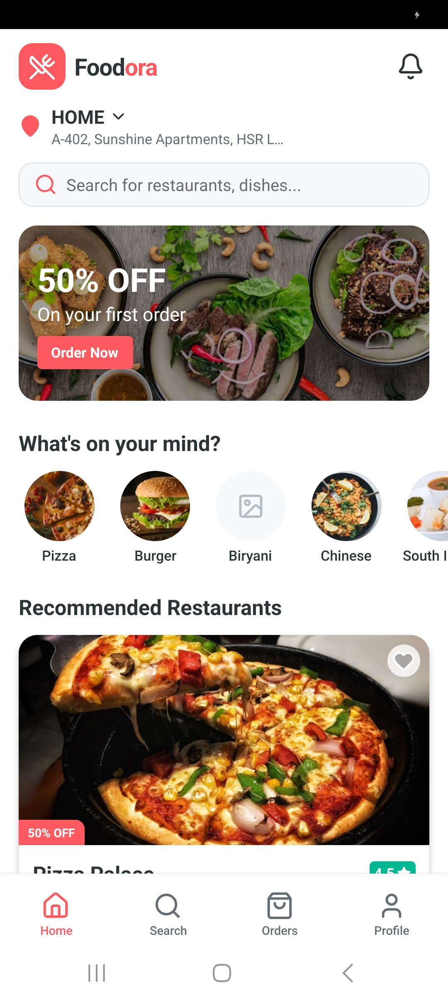
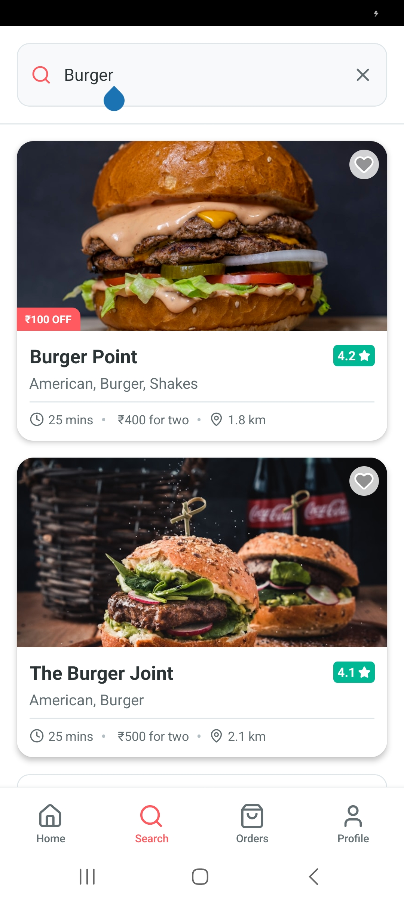
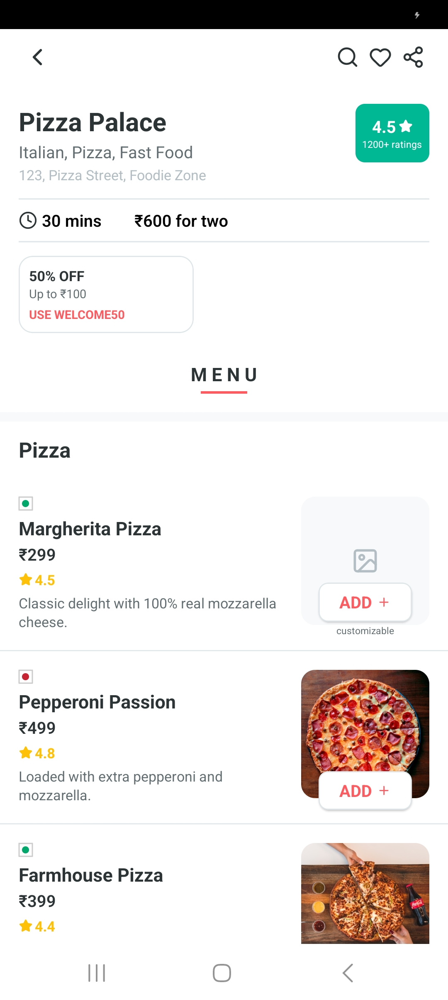
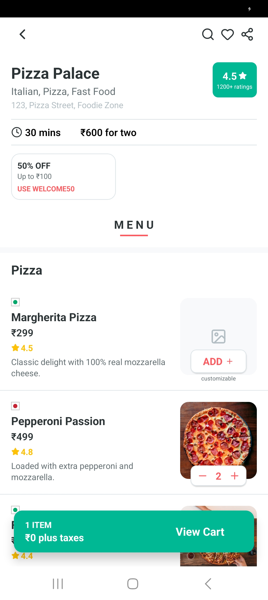
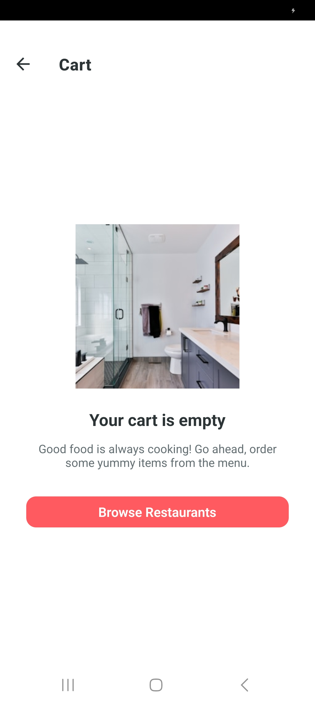
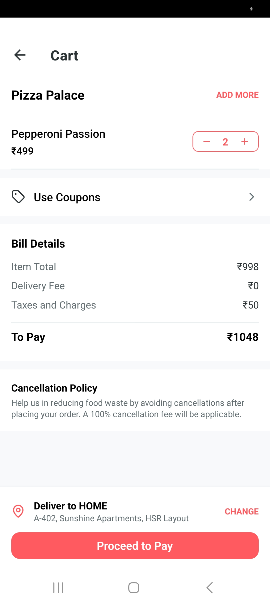
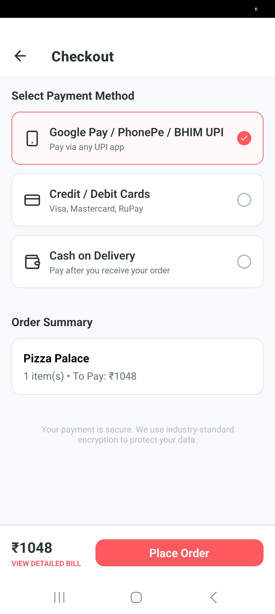
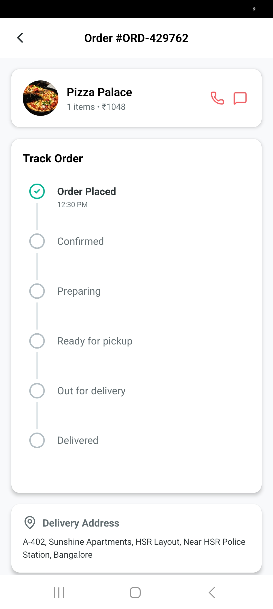
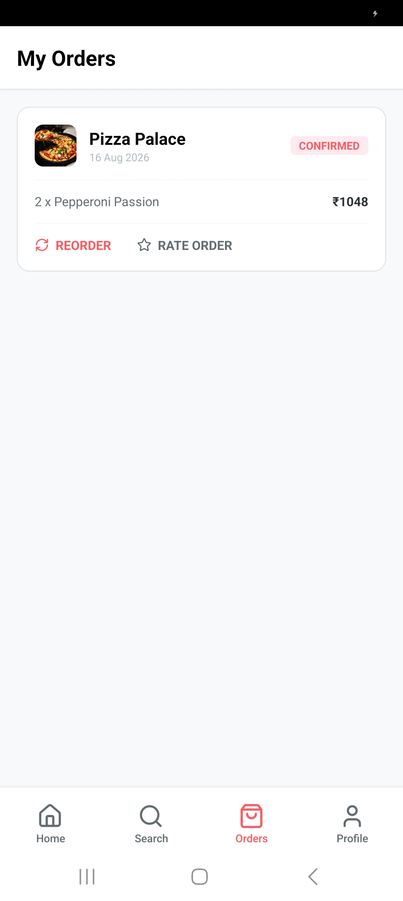

# Foodora - Good Food. Delivered. 🍔🚀

**[🌐 View Live Demo](https://shubham230523.github.io/FoodoraVibeCodingPractice/)**

Foodora is a premium, production-quality food delivery application built with **React Native** and **Expo**. Designed with a focus on seamless user experience, performance, and a modern design system, Foodora offers a complete journey from restaurant discovery to real-time order tracking.

---

## ✨ Features

- **📍 Smart Discovery**: Discover top-rated restaurants near you with a curated home feed, categorized by cuisines and special offers.
- **🔍 Advanced Search**: Fast, debounced search for finding your favorite dishes, restaurants, or cuisines.
- **🍱 Detailed Menus**: Browse sectioned menus with high-quality imagery and detailed dish information.
- **🛠️ Customization Engine**: Personalize your meals with a robust customization system (size, add-ons, toppings).
- **🛒 Dynamic Cart**: Smart cart management that handles multi-item orders and prevents cross-restaurant conflicts.
- **💳 Secure Checkout**: Multiple mock payment methods (UPI, Card, COD) with a detailed bill breakdown and coupon support.
- **🛰️ Real-time Tracking**: Monitor your order status with a live timeline from placement to delivery.
- **👤 Profile & History**: Manage saved addresses, view order history, and maintain your favorites.

---

## 📱 Screenshots

<p align="center">
  
  
  
</p>
<p align="center">
  <i>Splash Screen | Discovery | Search Results</i>
</p>

<p align="center">
  
  
  
</p>
<p align="center">
  <i>Restaurant Detail | Item Customization | Empty Cart State</i>
</p>

<p align="center">
  
  
  
</p>
<p align="center">
  <i>Review Cart | Secure Checkout | Live Order Tracking</i>
</p>

<p align="center">
  
</p>
<p align="center">
  <i>Order History</i>
</p>

---

## 🛠️ Tech Stack

- **Framework**: [Expo](https://expo.dev/) (SDK 57) / [React Native](https://reactnative.dev/)
- **Navigation**: [Expo Router](https://docs.expo.dev/router/introduction/) (File-based routing)
- **State Management**: [Zustand](https://github.com/pmndrs/zustand)
- **Data Fetching**: [TanStack Query](https://tanstack.com/query/latest) (React Query)
- **Persistence**: [Expo Secure Store](https://docs.expo.dev/versions/latest/sdk/secure-store/)
- **Styling**: React Native StyleSheet with a centralized Design System
- **Icons**: [Lucide React Native](https://lucide.dev/guide/packages/lucide-react-native)
- **Validation**: [Zod](https://zod.dev/) + [React Hook Form](https://react-hook-form.com/)
- **Animations**: [React Native Reanimated](https://docs.swmansion.com/react-native-reanimated/)

---

## 📂 Project Structure

```text
src/
 ├── app/              # Expo Router routes (Tabs, Stacks, Modals)
 ├── components/       # Reusable UI components (Common, Restaurant, Food, etc.)
 ├── features/         # Feature-based modules (Home, Search, Cart, Checkout)
 ├── store/            # Zustand state stores
 ├── services/         # API clients and storage services
 ├── types/            # TypeScript interfaces and enums
 ├── theme/            # Centralized design tokens (Colors, Typography, Spacing)
 └── utils/            # Helper functions and business logic
```

---

## 🚀 Getting Started

### 1. Clone the repository
```bash
git clone https://github.com/your-username/foodora.git
cd foodora
```

### 2. Install dependencies
```bash
npm install
```

### 3. Start the application
```bash
npx expo start
```

Use the **Expo Go** app on your phone or an emulator to view the app.

---

## 🧪 Testing

The project includes unit tests for core business logic (price calculations, taxes, etc.).

```bash
npm test
```

---

## 📄 License

This project is licensed under the MIT License - see the [LICENSE](LICENSE) file for details.

---

<p align="center">Made with ❤️ for Foodies by Shubham</p>
